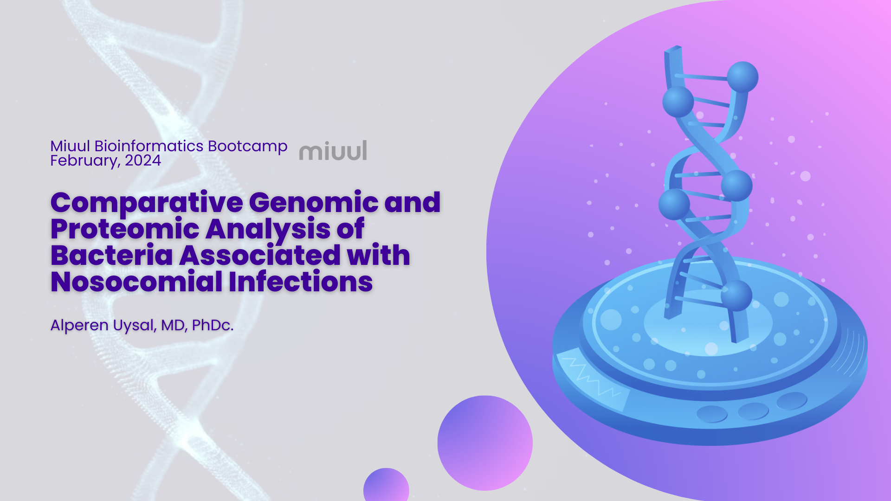
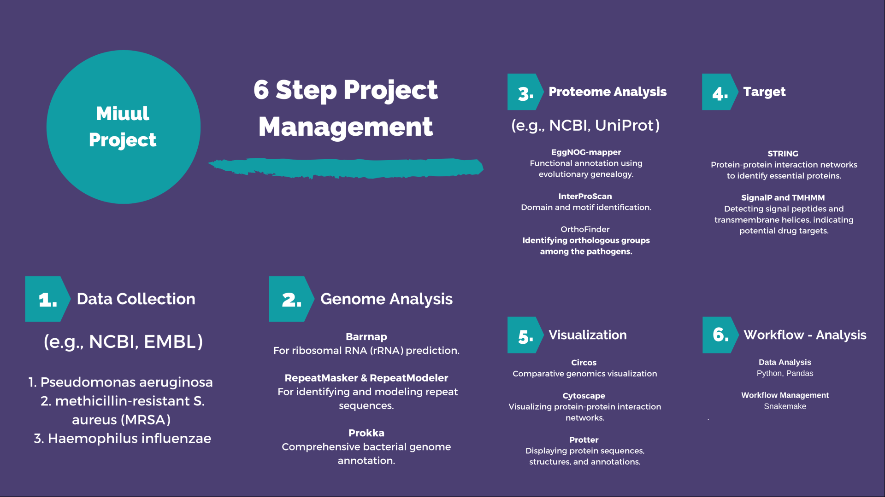

**Hello. This is my miuul.com Bioinformatics Bootcamp project.**

This project aims to compare the genomes and proteomes of three pneumonia-causing pathogens to identify potential drug targets through comprehensive genome and proteome analysis. Utilizing state-of-the-art bioinformatics tools, the project delves into the comparative genomics and proteomics landscape to unravel shared and unique biological features among the pathogens. The analysis pipeline is orchestrated using Snakemake, ensuring reproducibility and scalability of the computational workflows.

**Directory Structure**

env: Contains env.yaml files specifying the Conda environments for each Snakemake rule. These environments ensure that the correct software versions are used for each step of the analysis, facilitating reproducibility across different computational setups.

logs: Automatically generated logs from the execution of Snakemake rules are stored here. These logs provide valuable insights into the execution of each step in the pipeline, aiding in troubleshooting and understanding the workflow's performance.

output: This directory houses the outputs generated by various bioinformatics tools used throughout the project, such as genome annotation and ortholog finding tools. The outputs are primarily produced by Snakemake rules, organizing the results of the analysis in a structured manner for easy access and further investigation.

resource: The raw genome and proteome data for the pathogens under study are placed here. This data serves as the foundation for all subsequent analyses, including genome annotation, ortholog group identification, and secondary metabolite biosynthesis cluster prediction.

scripts: Contains the scripts utilized for analyses via Snakemake. These scripts embody the computational logic for each step of the analysis pipeline, from preprocessing data to invoking bioinformatics tools and processing their outputs.

This project harnesses the power of bioinformatics to offer insights into the molecular machinery of pathogens, spotlighting potential vulnerabilities that could be exploited for therapeutic intervention. Through a meticulously designed pipeline and organized project structure, it lays the groundwork for advancing our understanding of pathogenic mechanisms and accelerating the discovery of novel drug targets.
[dag.pdf](output%2Fplots%2Fdag.pdf)